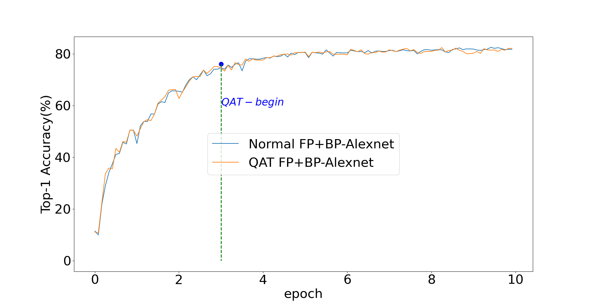

# Quantization-Aware-Training-on-backpropagation 
This Repo is aimed to QAT training both on forward and backward. 

Alexnet_qat  File centent:  
                --Alex_qat.py     : runing alexnet on QAT training  
                --Timer.py        : log and time class to log the infomation when training  
                --config.py       : alexnet qat project configuration  
                --quantizerAlex.py: quantizer API  
                
Result:

